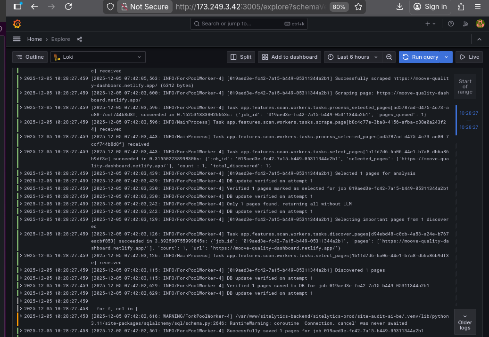

# Loki Stack Observability Guide

This document describes how to deploy and operate the Docker‑based Loki, Promtail, and Grafana stack that collects application logs, stores them centrally, and makes them explorable through Grafana. It expands on the exact steps that were executed on the host, the role of every YAML file, and how the Nginx reverse proxy and Grafana UI round out the workflow.

---

## 1. Architecture Overview

- **Purpose**: Centralize backend log files, retain them for seven days, and expose them to engineers through Grafana Explore for structured querying and streaming.
- **Components**:
  - **Promtail** tails application log files from `/app/logs` (mounted from `/var/log` on the host), enriches them with job labels, and streams them via HTTP to Loki.
  - **Loki** stores logs using the filesystem-backed BoltDB shipper schema and serves them over its HTTP API.
  - **Grafana** provisions Loki automatically as the default datasource and provides dashboards and Explore for log queries.
  - **Docker Compose** defines the containers, volumes, and networking glue so the stack can be started or updated atomically.
  - **Nginx** publishes Grafana over port `8080`, secures headers for WebSockets, and becomes the foundation for future subdomain + TLS hardening.

### Data Flow (Text Diagram)

```
Application log files (/var/log/*)
        │
        ▼
Promtail ──> Loki HTTP API ──> Grafana datasource ──> Explore & Dashboards
  (tail, label, push)      (store & index)            (query & visualize)
```

---

## 2. Host Preparation and Dependencies

Docker Engine, Docker Compose, and supporting runtimes are mandatory because each stack component runs as a container. Installing from Docker’s official repository guarantees up-to-date features and security patches.

1. **Remove legacy packages** to avoid conflicts with the modern Docker CE packages:
   ```sh
   sudo apt remove $(dpkg --get-selections docker.io docker-compose docker-compose-v2 docker-doc podman-docker containerd runc | cut -f1)
   ```
2. **Install repository prerequisites**:
   ```sh
   sudo apt update
   sudo apt install ca-certificates curl
   ```
3. **Add Docker’s GPG key and repository** (per [official docs](https://docs.docker.com/engine/install/ubuntu/)):
   ```sh
   sudo install -m 0755 -d /etc/apt/keyrings
   sudo curl -fsSL https://download.docker.com/linux/ubuntu/gpg -o /etc/apt/keyrings/docker.asc
   sudo chmod a+r /etc/apt/keyrings/docker.asc

   sudo tee /etc/apt/sources.list.d/docker.sources <<'EOF'
   Types: deb
   URIs: https://download.docker.com/linux/ubuntu
   Suites: $(. /etc/os-release && echo "${UBUNTU_CODENAME:-$VERSION_CODENAME}")
   Components: stable
   Signed-By: /etc/apt/keyrings/docker.asc
   EOF
   sudo apt update
   ```
4. **Install Docker Engine, containerd, Buildx, and the Compose plugin**:
   ```sh
   sudo apt install docker-ce docker-ce-cli containerd.io docker-buildx-plugin docker-compose-plugin
   ```
5. **Permit non-root usage** so the deployment scripts can run without `sudo`:
   ```sh
   sudo usermod -aG docker $USER
   sudo reboot
   ```

These steps ensure container builds, lifecycle commands (`docker compose up`), and volume mounts work consistently across environments.

---

## 3. Repository Layout

| File | Purpose |
|------|---------|
| `docker-compose.yml` | Declares the Loki, Promtail, and Grafana services, common network, port mappings, and persistent volumes. |
| `loki-config.yaml` | Defines Loki’s storage backend, listening ports, schema, retention policy, and ruler settings. |
| `promtail-config.yaml` | Lists every log scraping job, log file path, and label pipeline before logs are shipped to Loki. |
| `grafana-datasources.yaml` | Provisions Grafana with a default Loki datasource so Explore is ready immediately. |
| `assets/image.png` | Screenshot of the Grafana Explore log stream once Promtail is feeding Loki. |

---

## 4. Component Configuration Deep Dive

### 4.1 Loki (`loki-config.yaml`)

- **Server ports**: Exposes HTTP on `3100` (ingest/query) and gRPC on `9096` for internal APIs.
- **Storage**: Uses the filesystem backend at `/loki`, split into chunk and rule directories mounted from `./data/loki`.
- **Schema**: `boltdb-shipper` with daily index files keeps single-node deployments simple while retaining seven days of logs.
- **Limits**: `retention_period: 168h` enforces cleanup, and `reject_old_samples` avoids ingesting stale log entries.

This configuration keeps the system lightweight for a single VM yet ready for future scaling by migrating to object storage or clustering.

### 4.2 Promtail (`promtail-config.yaml`)

- **Listening ports**: Only HTTP (`9080`) is enabled, while gRPC is disabled because no remote management is required.
- **Positions file**: `/tmp/positions.yaml` tracks the last read offset for every log file, preventing duplicate ingestion.
- **Clients**: Loki’s internal DNS name `http://loki:3100` matches the Docker Compose network alias; no host networking is needed.
- **Scrape jobs**: Four jobs (staging/prod API and Celery) map paths under `/app/logs/*.log`. Each job attaches:
  - `job` labels for filtering in Grafana.
  - Pipeline stages that parse log levels via regex and promote them as labels for structured queries.

Mounting `/var/log` from the host into `/app/logs` (read-only) gives Promtail access to application logs without granting write access to the host filesystem.

### 4.3 Grafana Datasource (`grafana-datasources.yaml`)

- Provisions the Loki datasource via Grafana’s provisioning system.
- `access: proxy` instructs Grafana to forward queries through the Grafana backend, which is mandatory when Grafana and Loki share a Docker network.
- `isDefault: true` ensures Explore automatically selects Loki, so no manual configuration steps are needed post-deployment.

### 4.4 Docker Compose (`docker-compose.yml`)

- **Service definitions**: Each container pins a stable upstream image (`grafana/loki:2.9.3`, etc.) to guarantee reproducible builds.
- **Networks**: A shared user-defined bridge (`loki-network`) provides private DNS names (`loki`, `promtail`, `grafana`) and isolates traffic from other stacks.
- **Volumes**:
  - `./data/loki:/loki` and `./data/grafana:/var/lib/grafana` persist indexes, log chunks, and Grafana metadata even after container recreation.
  - Configuration files are bind-mounted read-only so they can be edited locally and picked up on restart.
- **Port mappings**:
  - Loki maps `3100:3100` for optional external access (useful for health probes).
  - Grafana maps `3000:3000` by default, but set it to `3005:3000` when fronted by the Nginx proxy described later. Open the firewall with `ufw allow 3005/tcp` when using that port.
- **Restart policy**: `unless-stopped` keeps services running across host reboots.
- **Why Compose**: Compose captures the entire topology in one declarative file, making it trivial to stand the stack up on new hosts, version-control changes, and coordinate start order (`depends_on`). Using `docker run` per container would lose those guarantees and make upgrades brittle.

---

## 5. Deploying the Stack

1. Clone or copy this repository onto the target host.
2. Confirm the directory structure (configuration files plus `assets/`).
3. Start the services:
   ```sh
   docker compose up -d
   ```
4. Validate container health:
   ```sh
   docker compose ps
   docker compose logs loki
   docker compose logs promtail
   ```
5. Inspect Grafana’s persistent state in `./data/grafana` to confirm volumes are mapped.

---

## 6. Network and Firewall Rules

- Allow Grafana’s host port when exposing it locally or to the reverse proxy:
  ```sh
  sudo ufw allow 3005/tcp
  ```
- Keep Loki’s port closed externally unless you need direct API access; Grafana and Promtail communicate internally via the Docker bridge.
- Future hardening: create a dedicated subdomain (for example, `logs.example.com`), issue TLS certificates (Let’s Encrypt), and update Nginx to terminate HTTPS before proxying into Grafana.

---

## 7. Nginx Reverse Proxy Integration

```
server {
    listen 8080;
    server_name 173.249.3.42;

    location / {
        proxy_pass http://127.0.0.1:3005;
        proxy_http_version 1.1;
        proxy_set_header Upgrade $http_upgrade;
        proxy_set_header Connection "upgrade";
        proxy_set_header Host $host;
        proxy_set_header X-Real-IP $remote_addr;
        proxy_set_header X-Forwarded-For $proxy_add_x_forwarded_for;
        proxy_set_header X-Forwarded-Proto $scheme;
        proxy_cache_bypass $http_upgrade;
    }
}
```

- **Why Nginx**: Acts as a hardened entry point with logging, rate limits, and TLS termination, shielding Grafana from direct public exposure.
- **Port mapping**: External clients reach `http://173.249.3.42:8080`, while Grafana listens on host port `3005` (remapped from container port `3000` in Compose). This separation lets you keep Grafana off the default port and apply firewall controls.
- **Headers**:
  - `Upgrade` and `Connection` maintain WebSocket and Server-Sent Events used by Grafana Explore’s live tail feature.
  - `X-Real-IP`, `X-Forwarded-*`, and `Host` preserve client context so Grafana audit logs and auth flows remain accurate.
  - `proxy_cache_bypass` ensures live dashboards are not cached when WebSockets fall back to HTTP polling.
- **Future improvement**: Replace the `server_name` IP with the planned subdomain and add `listen 443 ssl` with certificates to prevent anyone from accessing the raw IP.

---

## 8. Grafana Access and Operations

1. **Reach the UI**: Visit `http://<server-ip>:8080` (through Nginx) or `http://<server-ip>:3005` if accessing Grafana directly.
2. **Default credentials**: Grafana ships with `admin / admin` so administrators can log in the first time. Change the password immediately after the initial login (Grafana prompts automatically).
3. **Datasource verification**: Navigate to *Administration → Data sources* to confirm the provisioned Loki datasource exists and is set as default.
4. **Explore logs**:
   - Click the compass icon (Explore) on the right-hand menu.
   - Select `Loki` (already default) and choose a `job` label such as `staging-backend-api-logs`. These labels were added in `promtail-config.yaml`.
   - Use LogQL queries like `{job="prod-backend-celery-logs", level="ERROR"}` to filter to specific workloads and severity levels.
   - Enable *Live tail* to stream logs; Grafana maintains a WebSocket to the backend, which Nginx supports via the `Upgrade` headers above.



Promtail → Loki → Grafana integration in action:
- Promtail tags every log with `job` and `level`, pushing them over HTTP.
- Loki indexes those labels so queries remain inexpensive, even when tailing.
- Grafana Explore reads label metadata from Loki, which is why jobs instantly appear in the drop-down and why streaming honors label filters.

---

## 9. Day-2 Operations

- **Updating configuration**: Edit the YAML files and run `docker compose up -d` to recreate containers with new settings.
- **Log path changes**: Add new `static_configs` blocks in `promtail-config.yaml` with unique `job` labels when new services or environments are introduced.
- **Retention tweaks**: Adjust `limits_config.retention_period` in `loki-config.yaml` and ensure the filesystem has enough capacity for the longer window.
- **Backups**: Periodically snapshot `./data/grafana` (dashboards, users) and `./data/loki` (log indexes/chunks) if longer retention or compliance is required.

---

## 10. Next Steps and Enhancements

1. **Subdomain + TLS**: Point `logs.example.com` to the server, issue certificates (Let’s Encrypt + Certbot), and update Nginx to listen on 80/443 while redirecting HTTP to HTTPS.
2. **Authentication hardening**: Disable `GF_AUTH_ANONYMOUS_ENABLED` and integrate with SSO (OAuth, LDAP) for auditability.
3. **Alerting**: Connect Grafana Alerting to Prometheus or integrate Loki alerts via the Ruler to trigger notifications when log volume spikes or specific errors appear.
4. **Infrastructure as Code**: Wrap Docker Compose execution in systemd or CI pipelines so deployments are versioned and repeatable across environments.

With these instructions and explanations, any engineer on the team can reproduce the monitoring stack, understand how each YAML file influences the runtime behavior, and operate Grafana confidently.
